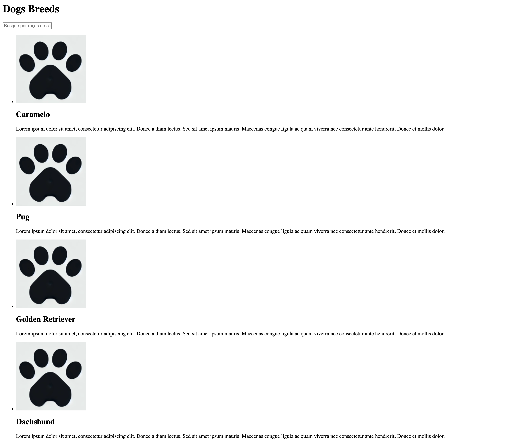
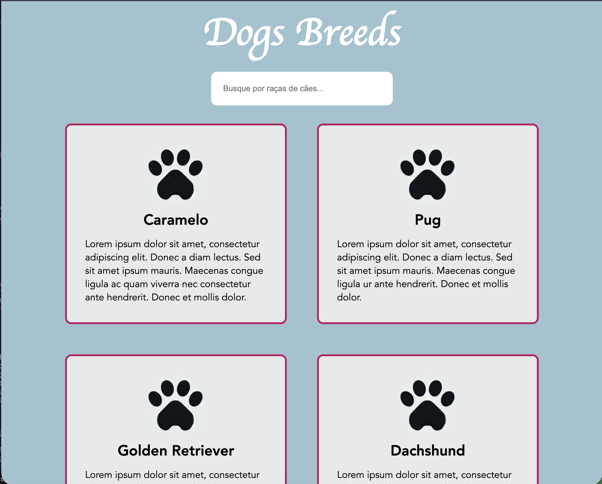

# Workshop Front-end: dos fundamento ao avançado

Material do workshop apresentado as alunas da comunidade WoMakersCode. Este material contém a criação de uma página HTML, aplicando estilização com CSS e tornando a página dinâmica com JavaScript

## Conteúdo

- HTML
- CSS
- JavaScript

### HTML

Resultado da construção da página HTML

  

- [W3Schools - HTML](https://www.w3schools.com/html/default.asp)

### CSS

Resultado da construção da página HTML com estilização usando CSS

  

- [W3Schools - CSS](https://www.w3schools.com/css/)

## 👩 Autora

| [ <b>@laisfrigerio</b>](https://github.com/laisfrigerio)  |
| :--------------------------------------------------------------------------------------------------------------------------------------------------------------------------------: |

## 📄 License

This project is licensed under the MIT License - see the LICENSE.md file for details
